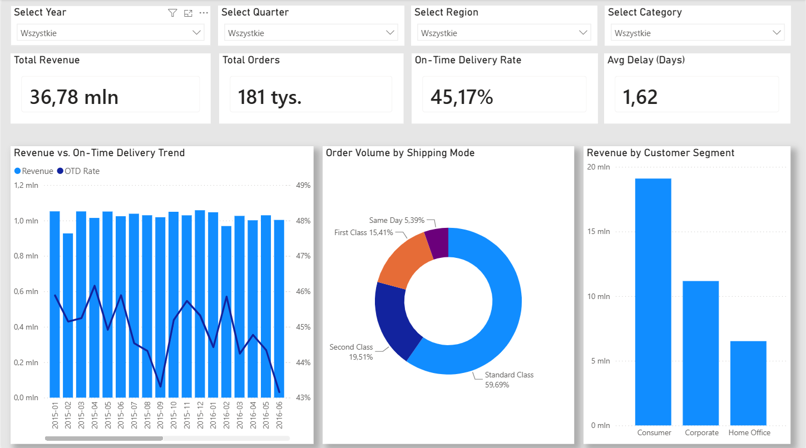
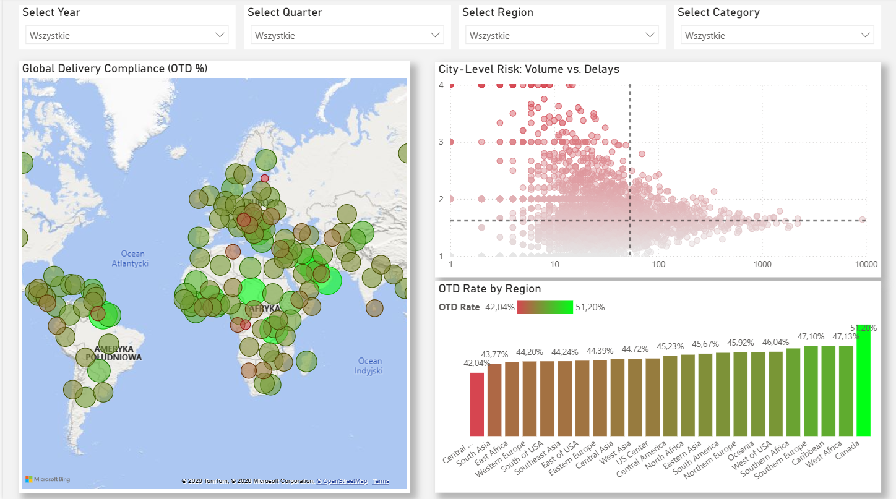
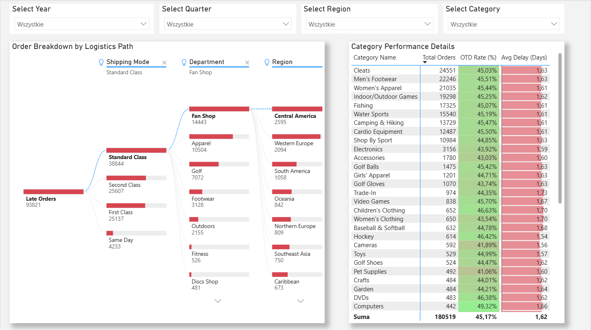
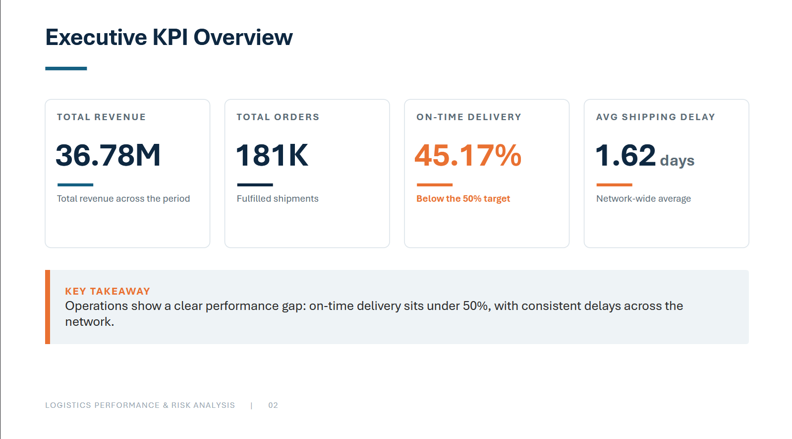
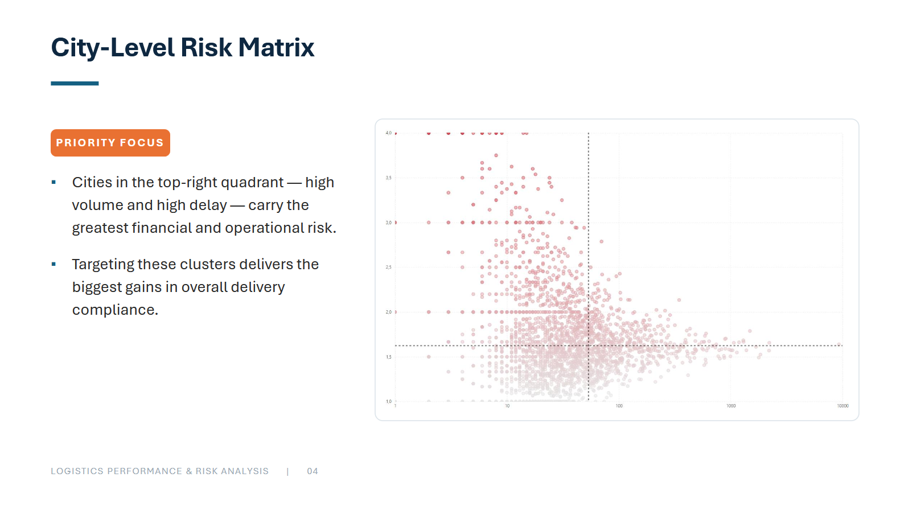
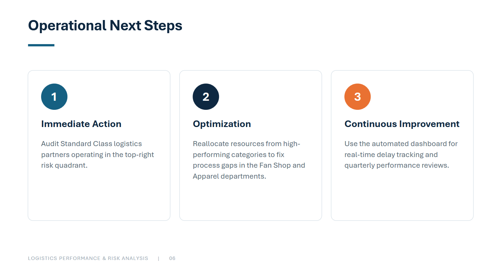

# Logistics Performance & Risk Analysis: 2015 – 2018

## Project Overview
This project is an end-to-end Business Intelligence solution designed to diagnose and visualize global supply chain inefficiencies. By analyzing 181,000+ orders across a four-year period, this dashboard transitions raw logistics data into an interactive diagnostic tool, pinpointing exactly where and why delivery delays occur.

The primary goal of this project was to move beyond simple descriptive statistics (what happened) and provide **diagnostic analytics** (why it happened) to empower business stakeholders with actionable, data-driven recommendations.

---

## Data Source
The analysis is based on a comprehensive global supply chain dataset sourced from [Kaggle](https://www.kaggle.com/datasets/shashwatwork/dataco-smart-supply-chain-for-big-data-analysis). It contains over 180,000 transaction records detailing fulfillment operations between 2015 and 2018. The dataset includes multiple dimensions such as geographic regions, shipping modes (e.g., Standard Class, First Class), product departments, and exact order-to-shipping timelines, providing a robust foundation for identifying operational bottlenecks.
---

## Dashboard Previews

### 1. Executive Summary & KPI Tracking
*(This view provides the high-level metrics for quick stakeholder consumption.)*

### 2. Geographic Risk Matrix
*(Identifying high-volume, high-delay clusters across the globe.)*

### 3. AI-Driven Root Cause Analysis
*(Decomposition tree identifying the exact bottlenecks in the logistics path.)*

---

## Methodology: How I Built This

To ensure accuracy, scalability, and performance, I followed a strict data engineering and modeling lifecycle:

1. **Database Architecture (MS SQL Server):** 
   - Imported the raw, flat logistics data from Kaggle into **Microsoft SQL Server**.
   - Architected a relational **Star Schema** by decomposing the data into distinct Fact (e.g., Orders/Shipments) and Dimension (e.g., Geography, Product, Time) tables. This optimized the database for fast analytical querying and reduced data redundancy.
2. **Data Cleaning & Power Query:** 
   - Connected Power BI to the MS SQL Server database and utilized **Power Query** for the final transformation layer.
   - Addressed dirty data, specifically handling null/blank values within regional and departmental columns to ensure accurate geographic mapping.
   - Standardized naming conventions across the dataset, converting backend database abbreviations into clean, business-friendly headers (e.g., converting `Avg_Shipping_Delay_Days` to `Avg Delay (Days)`).
3. **Data Modeling & DAX:** 
   - Leveraged the underlying Star Schema to create clean, one-to-many (1:*) relationships within the Power BI semantic model.
   - Engineered specific DAX measures to calculate performance benchmarks, including total revenue, order volume, and an On-Time Delivery (OTD) percentage.
   - Built a dynamic `Late Orders` measure (`[Total_Orders] - [Orders_On_Time]`) to isolate failures for root cause analysis.
4. **UI/UX & Visual Design:** 
   - Designed a clear, high-contrast visual hierarchy (Red/Green color coding) to immediately draw the user's eye to underperforming categories.

---

## The Biggest Challenge & Overcoming It

**The Challenge: Shifting from Descriptive to Diagnostic Analytics**
Initially, the data naturally guided the visuals toward highlighting successes - showing total orders and overall on-time delivery. However, presenting an OTD rate of 45.17% without explaining the *why* does not solve the business problem. The hardest part of this project was re-engineering the analytical focus from "what went right" to tracking "what went wrong."

**The Solution:**
I had to write custom DAX logic to isolate the negative variance (`Late Orders`) and feed that specific measure into Power BI's AI-driven Decomposition Tree. By explicitly commanding the AI to find the "Highest Value" of delays across multiple dimensions (Shipping Mode, Region, Department), the tool dynamically mapped out the exact failure paths. This shifted the dashboard from a static reporting screen into an interactive diagnostic engine, ultimately revealing that the "Standard Class" shipping mode was the primary operational bottleneck. 

---

## Key Business Insights
* **Delivery Deficit:** The global logistics network is severely underperforming, maintaining an On-Time Delivery Rate of only **45.17%** with an average delay of **1.62 days**.
* **Primary Bottleneck:** The AI path analysis identified that the "Standard Class" shipping mode is the most significant driver of late orders across all departments.
* **Geographic Risk:** Specific city clusters fall into the high-risk, top-right quadrant (High Volume / High Delay), presenting an immediate opportunity for targeted operational audits.

---

## Executive Presentation

To ensure these data insights are actionable for business stakeholders, I translated the dashboard findings into a concise, 6-slide executive presentation. 

The presentation bridges the gap between technical data modeling and business strategy by focusing strictly on the bottom line. It highlights the core performance gap - specifically that the on-time delivery rate sits under the 50% target at **45.17%** - and walks stakeholders through the geographic risk factors. 

Most importantly, it concludes with targeted operational next steps, such as auditing Standard Class logistics partners operating in the highest-risk top-right quadrant.

  
  
  

*Note: [Click here to view the full Executive Summary Presentation (PDF)](Executive%20Summary.pdf).*